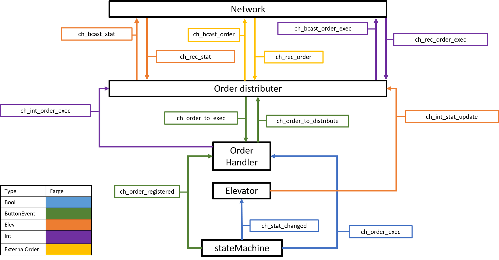

# README for elevator project spring 2020

## Using the simulator

To run a new elevator type in the following:

Choose a 5 digit connection port, i.e. `12345`.

In terminal running the simulator: `./SimElevatorServer --port 12345`

In the terminal running the program: `go run -ldflags="-X main.TCP_ConnectionPort=12345" main.go`


## Project description
This project aims to control a system of n elevators operating at m floors. The object is that the elevators should be able to distribute orders amongst themselves, such that the system ideally performs better than with one single elevator. The system should be fault-tolerant, meaning that all orders should be taken, even when errors appear.

In this specific software, we run 2 elevators, both operating at 4 floors. Although, the system is scalable such that it is possible to alter both the number of elevators and number of floors. Some assumptions were done in order to keep the project at a reasonable size. These where:
- We assume that at least one elevator works at each time.
- We assume that only one error occurs at a time.
- Stop- and Obstruction-buttons can be neglected.
- Also, we decided to assume that all passengers get on the elevator when it opens on their floor, regardless if the direction of the elevator and the passenger's requested direction is the same or not. This implies that all hall-orders (UP- or DOWN-orders) on a floor are cleared whenever an elevator stops. 


The software solution uses a **“momentary master”** procedure, where all elevators has the responsibility of distributing orders registered by their buttons. To do this, all elevators must have the knowledge of the current position, direction and order list of all other elevators at all times. In addition, all elevators must know which orders are active, that is which orders that already have been assigned and are to be taken. To achieve this, we utilize **UDP broadcasting** between the elevators. All orders that are registered are broadcasted, and the status of the elevator is broadcasted each time there is a change of status. These “messages” are broadcasted to specific ports assigned to each broadcast type.

To make sure the system is fault-tolerant, all elevators have a list of timestamps, that are activated/deactivated whenever an order is assigned/executed. If an elevator detects that the time since a timestamp exceeds a certain amount, the corresponding order is taken by the local elevator. In that way, we make sure that all orders are taken. However, we may observe that some orders are taken by several elevators. We found that this was a sufficient solution as it is more important for us that all orders are guaranteed to be taken rather than "saving energy" by holding back elevators.

This system consists of five main modules, each with its own responsibilities. These are: elevator, stateMachine, orderHandler, orderDistributer and network. Additionally, we have seperated lower level functions from the main modules into their own respective modules. Some of these are named after their corresponding main module (i.e. stateMachine-helpfunc) or simply stands on it's own (i.e. timer). You can read more about each module in their own README-file. A single elevator is operational through the main modules elevator, stateMachine and orderHandler. In order to understand our solution we encourage you to begin with these modules.


## Communication between modules

### Communication sequences
The communication between the modules is mainly done by sending messages over channels. In this system there are three main sequences of messaging, and they consern: status updates, registered orders and executed orders.

#### Status updates
For the system to be able to correctly distribute orders, all elevators must know the status of all other elevators. The relevant information is each elevators current position, current direction and their order list.

To be able to seperate the elevators, all elevators has a unique ID. The ID is the same as the TCP port used to communicate with the elevator server.

A status update is to be sent every time something has happened. That is, every time the elevator reaches a new floor or changes direction. When this happens, the stateMachine-module sends a boolean `true` to the elevator-module, thereby telling the elevator-module that there has been a change of state. The elevator-module then sends a copy of the elevator object to the orderDistributer.

The orderDistributer registers the status update correctly by placing the elevator object in the list `ELEVATOR_STATUS_LIST` and the corresponding ID on the same place (same index) in the list `ADDED_ELEVATORS`. When the status update has been correctly registerd, it is sent to the network-module, to be broadcasted.

All status updates are broadcasted to the same port (`20000`). The function InitializeStatusUpdates starts two goroutines which at all time broadcast all status updates sent on a specific channel, and sends all messages received on port `20000` on another. When a status update from another elevator has been received, the status lists are updated as previously described.


#### Order registered

An order is registered by an elevator in the form of a button push detected in the stateMachine. When a button is pushed, the corresponding order is sent to the orderHandler-module. These orders are called "*internal orders*" and are on the form of a `ButtonEvent` (see the elevio-module).

The orderHandler decides what to do with the order. If the order is a cab-order, it must be taken by the local elevator, as this has to be ordered within a spesific elevator. The order is therefore only inserted in the order list of the local elevator, and the communication sequence ends.

If, however, the order is a hall-order, it is sent directly to the orderDistributer. The orderDistributer now has to decide which elevator should operate the order. This is done with the help of a cost function, which can be found in orderDistributer-helpfunc. When we have found the owner of the order, the internal order is converted to the an "*external order*". The structure *external order* is described in the README in orderDistributer. The external order is sent to the network-module, where it is broadcasted to a specific order port.

Whenever there has happend a broadcast to the order port, the network-module sends the order to the orderDistributer. If the ID of the owner of the order is the same as the local ID, the order is converted back to an internal order. Further, it is sent to the orderHandler where it is placed in the order list of the local elevator.

#### Order executed
To be able to make sure that all orders are executed, we must let the other elevators know each time an order has been completed. 

In this project, we assume that if the elevators stop at a floor, all passagers at that floor will board the elevator. Thus, each time elevator stops at a floor, we can assume that all hall-orders at that floor are executed. Each time the stateMachine registeres that an order has been executed at a floor, a boolean `true` is sent to the order handler saying: "all orders on the current floor are executed". The orderHandler then sends the current position (`floor (int)`) of the elevator to the orderDistributer.

The orderDistributer then registers that the order has been executed. This is done by removing all hall-orders on the correct floor, from the list of active orders. Next, the message that an order has been executed (`floor (int)`), is sent to the network-module, where it is broadcasted on a unique order-executed-port.

Each time the network-module detects that a message has been broadcasted to the order-executed-port, a message on the form (`floor (int)`) is sent to the orderDistributer, where the orders at the corresponding floor are removed from the list of active orders.


### Communication overview

The following figure shows an overview of the most important communication channels between the five main modules:




### Channel descriptions

#### ch_new_order:
*Type:* `ButtonEvent`

*Usage:* New order

*Info*: Whenever a new order is registered by the orderHandler, the order is sent to the stateMachine.

#### ch_order_registered:
*Type:* `ButtonEvent`

*Usage:* Order registered

*Info*: Whenever the stateMachine registeres that a button has been pushed, the order (`ButtonEvent`) corresponding to the pushed button is sent to the orderHandler using the channel `ch_order_registered`.

#### ch_order_executed:
*Type:* `Bool`

*Usage:* Order executed

*Info*: Whenever the elevator stops on a floor, one or more orders are executed. The stateMachine then sends a `true` over the channel `ch_order_executed`, to the orderHandler, indicating that some or all orders on the floor the elevator is currently at, has been executed.

#### ch_stat_updated:
*Type:* `Bool`

*Usage:* Elevator status has changed

*Info*: Whenever a message is sent on this channel, the elevator-module sends a status update to the orderDistributer

#### ch_int_stat_update:
*Type:* `Elev`

*Usage:* Internal status update

*Info*: Whenever the elevator-module is informed that the status has been changed by the channel above, a copy of the elevator object is sent to the orderDistributer over the channel `ch_int_stat_update`.

#### ch_order_to_exec:
*Type:* `ButtonEvent`

*Usage:* Order to execute

*Info*: If the orderDistributer distributes an order to the local elevator, it is sent to the orderHandler via the channel `ch_order_to_execute`.

#### ch_order_to_distribute:
*Type:* `ButtonEvent`

*Usage:* Order to distribute

*Info*: All hall-orders that the orderHandler registers must be sent to the orderDistributer, to be distributed. Thus, all hall-orders is sent to the orderDistributer via the channel `ch_order_to_distribute`.

#### ch_bcast_stat_update:
*Type:* `Elev`

*Usage:* Broadcast status

*Info*: Channel for sending internal status update to the network-module, so that it is distributed to other elevators.


#### ch_ext_stat_update: IS THIS CORRECT?
*Type:* `Elev`

*Usage:* Receive status

*Info*: Channel for receiving status updates broadcasted by other elevators. The status update is sent to the local orderDistributer, so that the status lists can be updated.


#### ch_bcast_order:
*Type:* `ExternalOrder`

*Usage:* Broadcast order

*Info*: Channel for broadcasting orders that are distributed by the local orderDistributer.

#### ch_rec_ext_order:
*Type:* `ExternalOrder`

*Usage:* Receive order

*Info*: Channel for receiving orders that are broadcasted to the order-port (see network-module). All orders broadcasted to this port are sent to the orderDistributer using this channel.

#### ch_bcast_order_exec:
*Type:* `Int`

*Usage:* Broadcast order executed

*Info*: Channel for broadcasting that all orders are executed on a specific floor. Whenever an order has been executed, the orderDistributer sends a message to the network-module, that includes which floor the orders where executed at. The network-module then broadcasts the message to a unique order-executed-port (see network-module). The message descirbed is sent via this channel.

#### ch_rec_order_exec:
*Type:* `Int`

*Usage:* Receive order executed

*Info*: Whenever the network-module detects that a message has been broadcasted to the order-executed-port (see network-module), the message is sent directly to the orderDistributer, using this channel.

#### ch_int_order_exec:
*Type:* `Int`

*Usage:* Internal order executed

*Info*: When an internal order is executed at a floor, all orders at that floor are executed. Whenever an order is executed, the floor of which order has been executed at is sent from the order handler to the order distributer.

#### ch_order_timeout:
*Type:* `ButtonEvent`

*Usage:* Time-out for non-executed orders

*Info*: When an internal order is not executed for a fixed time after it has been taken, the order is redistributed to another elevator.


### Goroutines

These are the goroutines we use. The first three are used for polling new statuses, updates and timeouts. The last five are the main functions of the program, that takes care that each order is registered, distributed, executed and removed properly. To read more about these routines, see their respective modules.

```
  //Polling

    go elevator.PollInternalElevatorStatus(&elev, ch_stat_updated, ch_int_stat_update) 

    go orderDistributer.PollStatusUpdates(ch_int_stat_update, ch_ext_stat_update, ch_bcast_stat_update)

    go orderDistributer.PollOrderTimeout(ch_order_timeout)


  //Each button-push "travels" through these goroutines in order to be distributed and executed properly

    go orderHandler.DistributeInternalOrders(&elev,ch_order_registered, ch_order_to_exec, ch_order_to_distribute, ch_new_order)

    go orderDistributer.ReceiveOrders(ch_rec_ext_order, ch_order_to_exec)

    go orderDistributer.DistributeOrders(ch_order_to_distribute, ch_order_to_exec, ch_bcast_order, ch_order_timeout)

    go orderHandler.RegisterExecutedOrders(&elev,ch_order_executed, ch_int_order_exec)

    go orderDistributer.RegisterExecutedOrders(ch_rec_order_exec, ch_int_order_exec, ch_bcast_order_exec)

```
