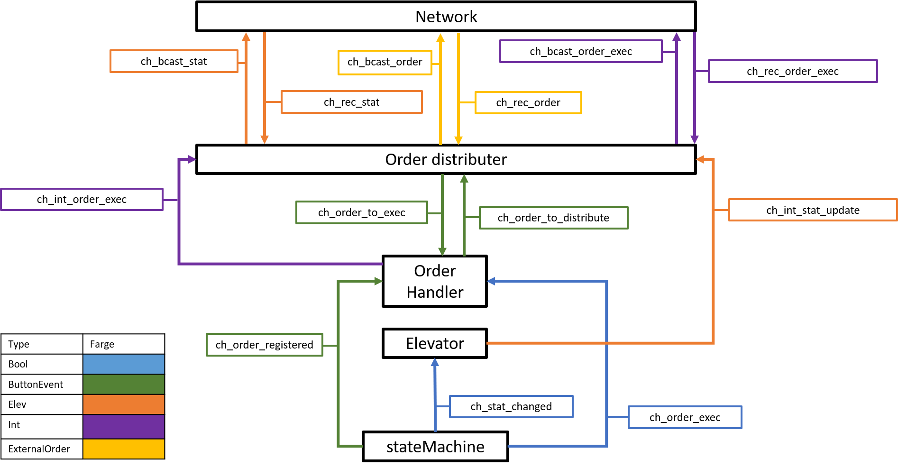

# ReadMe for elevator project spring 2020

## Using the simulator

To run a new elevator type in the following:

Choose a 5 digit connection port, i.e. 12345.

In the terminal running the program:
go run -ldflags="-X main.TCP_ConnectionPort=12345" main.go

In terminal running the simulator:

./SimElevatorServer --port 12345

## Project description
This project aims to control a system of n elevators operating at m floors. The object is that the elevators should be able to distribute orders amongst themselves, such that the system ideally performs better than with just one single elevator. The system should be fault-tolerant, meaning that all orders should be taken, even when errors appear.

In this specific software, we run 2 elevators, both operating at 4 floors. Although, the system is scalable such that it is possible to alter both the number of elevators and number of floors. We assume that at least one elevator works at each time.

The software uses a “momentary master” procedure, where all elevators has the responsibility of distributing orders registered by themselves. To do this, all elevators must have the knowledge of the current position, direction and order list of all other elevators at all time. In addition, all elevators must know which orders are active, that is which orders that already have been assigned and are to be taken. To achieve this, we utilize UDP broadcasting. All orders that are registered are broadcasted, and the status of the elevator is broadcasted each tie there is a change of status. These “messages” are broadcasted to specific ports assigned to each broadcast type.

To make sure the system is fault-tolerant, all elevators has a list of timestamps, that are activated/deactivated whenever an order is assigned/executed. If an elevator detects that the time since a timestamp exceeds a certain amount, the corresponding order is taken by the local elevator. In that way, we make sure that all orders are taken, however, we may observe that some orders are taken by several elevators. 

This system consists offive main modules, each with its own responsibilities. These are: FSM, Elevator, Order Handler, Order Distributer and Network. You can read more about each module in their own readme files.

## Comunication between modules
### Communication sequences
The communication between the modules are mainly done by sending messages over channels. In this system there are three main sequences of messaging, and they consern: status updates, registered orders and executed orders.

#### Status updates
For the system to be able to correctly distribute orders, all elevators must know the status of all other elevators. The relevant information is each elevators current position, current direction and their order list.

To be able to seperate the elevators, all elevators has a unique ID. That ID is the same as the TCP port used to communicate with the elevator server.

A status update is to be sent every time there has happend a status update. That is, every time the elevator reaches a new floor or changes direction. When this happens, the FSM module sends a boolean true to the elevator module, thereby telling the elevator module that there has been a change of state. The elevator module then sends a copy of the elevator object to the order distributer.

The order distributer registers the status update correctly by placing the elevator object in the list ELEVATOR_STATUS_LIST and the corresponding ID on the same place (same index) in the list ADDED_ELEVATORS. When the status update has been correctly registerd, it is sent to the network module, to be broadcasted.

All status updates are broadcasted to the same port (20000). The function StartSendingAndReceivingStatusUpdates starts two goroutines which at all time broadcasts all status updates sent on a specific channel, and sends all messages received on port 20000 on another. When a status update from another elevator has been received, the status lists are updated as described earlier.

#### Order registered
An order is registered by an elevator in the form of a button push detected in the FSM. When a button is pushed, the corresponding order is sent to the order handler module. These orders are called "*internal orders*" and are on the form of an ButtonEvent (see elevio).

The order handler module now has to decide what to do with the order. If the order is a cab order, it must be taken by the local elevator. The order is therefore inserted in the order list of the local elevator, and the communication sequence ends.

If, however, the order is a hall order, it is sent directly to the order distributer.

The order distributer now has to decide which elevator should operate the order. This is done with the help of a cost function, which can be found in orderDistributer-helpfunc. When we have found the owner of the order, the internal order is converted to the an "*external order*". The structure *external order* is described in the readme in orderDistributer. The external order is sent to the network module, where it is broadcasted to a specific order port.

Whenever there has happend a broadcast to the order port, the network module sends the order to the order distributer. If the ID of the owner of the order is the same as the local ID, the order is converted back to an internal order, before it is sent to the order handler where it is placed in the order list of the local elevator.

#### Order executed
To be able to make sure that all orders are executed, we must let the other elevators know each time we have completed an order. 

In this project, we assume that if the elevators stop at a floor, all customers at that floor will board the elevator. Thus, each time elevator stops at a floor, we can assume that all orders at that floor are executed. Each time the FSM registeres that an order is executed at a floor, a boolean true is sent to the order handler saying: "all orders on the current floor are executed". The order handler then sends the current position (floor (int)) of the elevator to the order distributer.

The order distributer must now both register that an order is executed. This is done by removing all orders on the correct floor, from the list of active orders. Next, the message that an order has been executed (floor (int)), is sent to the network module, where it is broadcasted on a unique order-executed-port.

Each time the network module detects that a message has been broadcasted to the order-executed-port, a message on the form (floor (int)) is sent to the order distributer, where the orders at the corresponding floor are removed from the list of active orders.

### Communication overview
The following figure shows an overview of the most important communication channels between the five main modules:

### Channel descriptions
#### ch_order_reg:
Type: ButtonEvent

Usage:

Order registered

Whenever the FSM registeres that a button has been pushed, the order (ButtonEvent) corresponding to the pushed button is sent to the Order Handler using the channel ch_order_registered.

#### ch_order_exec:
Type: Bool

Usage:

Order executed

Whenever the elevator stops on a floor, one or more orders are executed. The FSM then sends a True over the channel ch_order_executed, to the order handler, indicating that all orders on the floor the elevator is currently at, has been executed.

#### ch_status_changed
Type: Bool

Usage:

#### ch_int_stat_update
Type: Elev

Usage:

Internal status update

Whenever the Elevator object module is informed that the status has been changed, a copy of the elevator object is sent to the order distributer over the channel ch_internal_status_update

#### ch_order_to_exec
Type: ButtonEvent

Usage:

Order to execute

If the order distributer distributes an order to the local elevator, it is sent to the order handler via the channel ch_order_to_execute

#### ch_order_to_distribute
Type: ButtonEvent

Usage:

All hall-orders that the order handler receives from the fsm must be sent to the order distributer, to be distributed. Thus, all hall-orders from the FSM is sent to the order distributer via the channel ch_order_to_distribute.

#### ch_int_order_exec
Type: Int

Usage:

Internal order executed

When an internal order is executed at a floor, all orders at that floor are executed. Whenever an order is executed, the floor of which order has been executed at is sent from the order handler to the order distributer.

#### ch_bcast_stat
Type: Elev

Usage:

Broadcast status

Channel for sending internal status update to the network module, so that it is distributed.

#### ch_rec_stat
Type: Elev

Usage:

Receive status

Channel for receiving status updates broadcasted by other elevators. The status update is sent to the order distributer, so that the status lists can be updated.

#### ch_bcast_order
Type: ExternalOrder

Usage:

Broadcast order

Channel for broadcasting orders that are distributed by the local order distributer.

#### ch_rec_order
Type: ExternalOrder

Usage:

Receive order

Channel for receiving orders that are broadcasted to the order-port (see network). All orders broadcasted to this port is sent to the order distributer using this channel.

#### ch_bcast_order_exec
Type: Int

Usage:

Broadcast order executed

